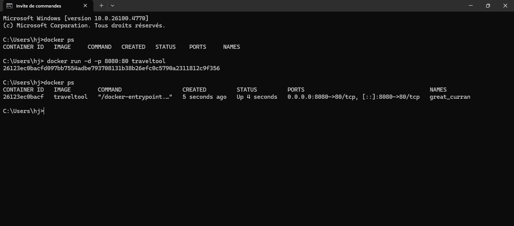
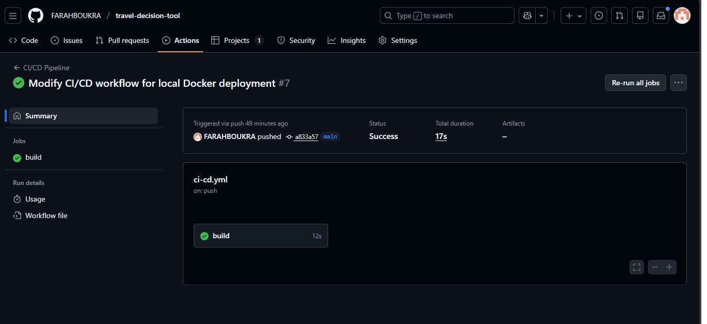

index.html

// RAPORT:
 1. Introduction :

    Ce projet a pour objectif de mettre en place une pipeline CI/CD complète pour un site web statique (HTML/CSS/JS) en utilisant

       GitHub, Docker et GitHub Actions.

    Le but est d’automatiser les étapes de build, test et déploiement, comme dans un environnement DevOps professionnel.

3. Outils et Technologies Utilisés :

      Git & GitHub : gestion de version et hébergement du code.

     Docker : conteneurisation de l’application via une image nginx.

     GitHub Actions : automatisation des workflows CI/CD.

    HTML / CSS / JavaScript : construction du site web statique.

     Nginx : serveur utilisé dans le conteneur Docker.

5. Étapes Réalisées :
 
   3.1. Création du dépôt GitHub :

      Initialisation du dépôt.

      Ajout des fichiers du site statique.

     Organisation de l’architecture du projet.

   3.2. Conteneurisation avec Docker:

     Rédaction d’un Dockerfile basé sur nginx:alpine.

     Construction de l'image : L'image Docker a été construite à partir du Dockerfile du projet.

     Vérification de l'image :  Nous avons confirmé que l'image a bien été créée sur la machine.

     Exécution de l'image :    Le conteneur a été lancé et l'application est accessible dans le navigateur à l'adresse :  
          [http://localhost:8080](http://localhost:8080).

     Preuve du fonctionnement : capture d'écrond montrant l'image Docker en cours d'exécution :  

      

   3.3. Pipeline CI/CD avec GitHub Actions :

      Le workflow contient trois étapes :

   Build : Construction de l’image Docker.

    Test : Vérification de la présence des fichiers HTML/CSS/JS.

    Deploy : Déploiement sur un registre Docker ou serveur distant via SSH (selon la configuration).

     Preuve du fonctionnement : capture d'écrond montrant d'exécution de pipline :  

      

4.Difficultés Rencontrées et Solutions:

1.Compréhension de la liaison Docker – GitHub

solution:

Téléchargement du projet depuis GitHub.

Vérification de la présence du Dockerfile.

Construction de l’image Docker et lancement du conteneur.

Test de l’accès à l’application via le navigateur.

2. Test et exécution de l’image Docker

solution:

Construction de l’image et vérification du build.

Lancement du conteneur et surveillance des sorties.

Test de l’application via le navigateur.

3. Échec de l’authentification Docker dans le pipeline CI/CD
   
Solution : Vérifier que les identifiants Docker (comme les tokens) sont bien stockés

dans les secrets GitHub Actions et correctement référencés dans le fichier de workflow.

4. Sécurisation des informations sensibles dans un projet collaboratif
   
Solution : Utiliser exclusivement les variables secrètes de GitHub Actions pour les mots 

de passe et tokens, et éviter de les écrire en clair dans le code.

5. Coordination de l’équipe lors de la configuration du CI/CD
   
Solution : Organiser une revue des permissions et des étapes de déploiement avec tous 

les membres pour s’assurer que chacun a les accès nécessaires.

